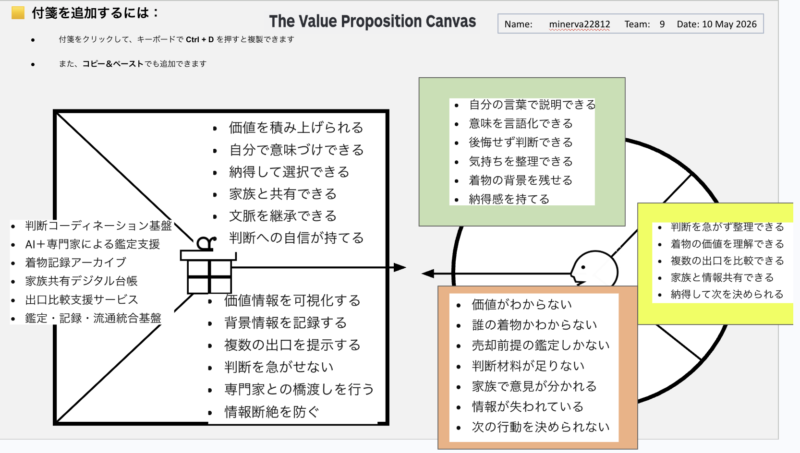

# Value Proposition Canvas v1

## Customer Profile (顧客像)

- **Customer Jobs**
  - 判断を急がず整理できる
  - 着物の価値を理解できる
  - 複数の出口を比較できる
  - 家族と情報共有できる
  - 納得して次を決められる

- **Pains**
  - 価値がわからない
  - 誰の着物かわからない
  - 売却前提の鑑定しかない
  - 判断材料が足りない
  - 家族で意見が分かれる
  - 情報が失われている
  - 次の行動を決められない

- **Gains**
  - 自分の言葉で説明できる
  - 意味を言語化できる
  - 後悔せず判断できる
  - 気持ちを整理できる
  - 着物の背景を残せる
  - 納得感を持てる

## Value Map (提供価値)

- **Products & Services**
  - 判断コーディネーション基盤
  - AI+専門家による鑑定支援
  - 着物記録アーカイブ
  - 家族共有デジタル台帳
  - 出口比較支援サービス
  - 鑑定・記録・流通統合基盤

- **Pain Relievers**
  - 価値情報を可視化する
  - 背景情報を記録する
  - 複数の出口を提示する
  - 判断を急がせない
  - 専門家との橋渡しを行う
  - 情報断絶を防ぐ

- **Gain Creators**
  - 価値を積み上げられる
  - 自分で意味づけできる
  - 納得して選択できる
  - 家族と共有できる
  - 文脈を継承できる
  - 判断への自信が持てる
